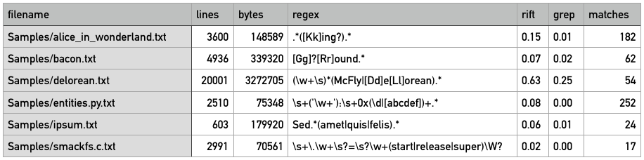
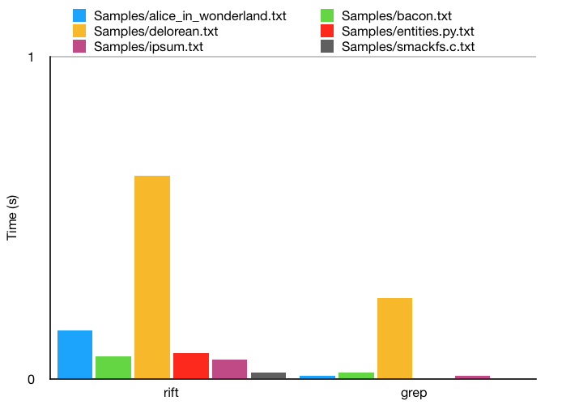

# Testing document

## Scope of testing

Tests have been implemented as unit and integration tests using the [XCTest library][xctest] included in Swift. Custom data structures have been tested with unit tests, as have the main logic for expression parsing and NFA construction. Integration tests have this far been implemented mainly in conjunction with the tests for expression parsing and NFA construction.

Some cases have been tested for performance using `measure`-blocks. The purpose of these tests are to measure the performance of the parsing stage, and more importantly the input matching. Currently only common [ReDoS][redos] have been tested, but the intention is to add more regular cases as well in the near future.

Additionally, the performance of non-malicious regular expressions has been compared against `grep` with identical extended syntax regular expressions and identical inputs. More about this can be read about in the [implementation document](IMPLEMENTATION.md#Comparison) under the *Comparison* header, and at the end of the [user guide](USAGE.md#Release).

## Inputs

The inputs have mainly been benign expressions, and – as mentioned – malicious expressions have been tested for performance tests. The length of the tested input strings have been relatively short, but this has been enough for validating the correctness of the matching. Larger inputs have been tested using the compiled binary, producing identical results to `grep` for regular expressions valid for both programs.

## Running the tests

Currently the tests are implemented as an independent macOS test target. This means that the following tools are required in order to run the tests in their current form:

- macOS 10.14.4
- Xcode 10.2
- Swift 5.0

Auto-generated test files have also been included for Linux compatibility, and they seem to work as expected using a Docker container with Swift installed.

### macOS

Assuming the aforementioned requirements are met, the tests can be run in Xcode with the key combination **⌘ + U**.

### Linux

Install [Swift 5.0][swift]. The release includes [Swift Package Manager][spm], which is required for the `Package.swift` manifest file. The tests should then be runnable using the command `swift test` in the directory containing the `Package.swift` file.

### Docker

Start the container using the command `make container` in the directory containing the Makefile. Once the container is up and running, the use the command `swift test` to run the tests.

## Test results

All tests are passing and [coverage](coverage.txt) is above 90%, although several limits probably remain untested. Thus far, all regular expressions conforming to the implemented feature set have been evaluated correctly – valid inputs have been matched, and invalid inputs rejected.

As expected, some pathological cases cause problems for matching efficiency. Regular expressions such as `(a+)+` suffer from exponential growth for each additional matching input character. E.g. the input string `aaaaaaaaaaaaaaa` already requires 0.4 seconds (unoptimized, with debug symbols) to be matched. This issue could potentially be remedied, as discussed in the [implementation document](IMPLEMENTATION.md).

As far as I've tested, average cases perform quite well. After compilation using standard optimizations, the efficiency of the program is within the same order of magnitude as `grep`. Below is a table and chart illustrating the performance differences for the comparisons.

[xctest]: https://github.com/apple/swift-corelibs-xctest
[redos]: https://en.wikipedia.org/wiki/ReDoS
[swift]: https://swift.org/download/
[spm]: https://swift.org/package-manager/
